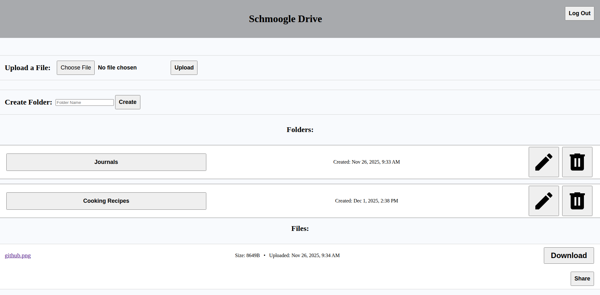

# TOP-File-Uploader

A full-stack file management application where users can CRUD (create, read, update, delete) folders, upload files, and download files. Uploaded files can be shared with others via a time-limited link. Files are securely uploaded to Supabase cloud storage using signed URLs. Express, PostgreSQL, and Prisma manage authentication, metadata, and authorization for access. Application site and database is deployed using Railway.

**Site Link:** https://top-file-uploader-production-b6c8.up.railway.app/

---

  

---

## Why I Built This

I wanted to build a practical, end‑to‑end project that mirrors real file‑hosting products: secure uploads, structured organization (folders), and controlled sharing. This project helped me get hands‑on experience with authenticated file workflows, storing metadata cleanly in a relational database, and integrating cloud storage safely using signed URLs rather than exposing buckets publicly.

---

## Features

- **Authentication (Sessions + Passport):** Users sign in to manage their own content.
- **Folder Management (CRUD):** Create, rename, view, and delete folders.
- **Files on Supabase Storage:** Secure uploads and downloads via signed URLs.
- **Expiring Share Links:** Generate shareable links that expire after 24 hours.

---

## Tech Stack

| Layer          | Technology               |
| -------------- | ------------------------ |
| Back-end       | Node.js, Express         |
| Front-end      | EJS                      |
| Database       | PostgreSQL               |
| ORM            | Prisma                   |
| Authentication | Passport (session‑based) |
| File Storage   | Supabase Cloud Storage   |

---

## For Setup (Local Development)

- **Node.js**
- **PostgreSQL** (local or hosted)
- **Supabase** file storage
